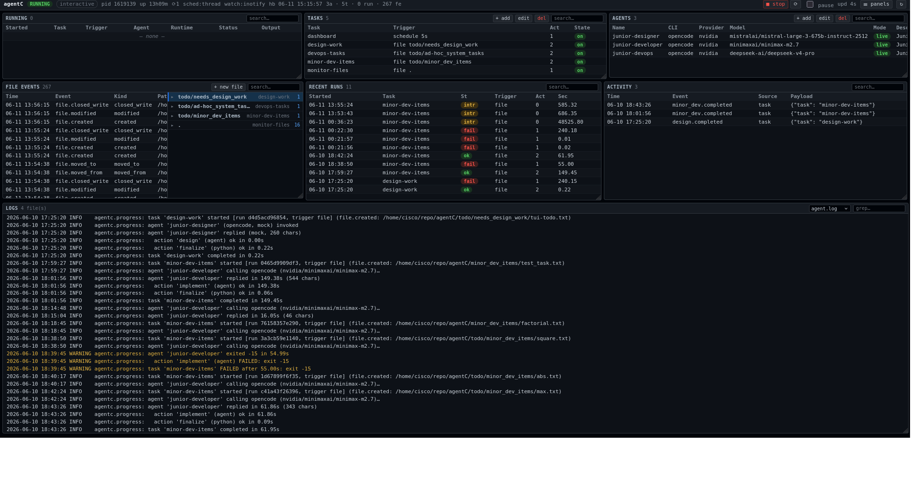

# agentC

**An AI agent team orchestration framework.**

agentC lets you assemble a team of AI **agents** — each a CLI coding/chat tool
(`claude`, `opencode`, `codex`, `gemini`) bound to an API provider, a model, and
a system prompt — and put them to work on **tasks**: ordered pipelines of
**actions** that can run shell commands, Python scripts, or agent prompts. Tasks
run **on demand**, **on a schedule**, or **in response to events**, including
Linux filesystem events (a file landing in a folder, a file being updated).

Everything is configured with plain JSON (or YAML), and all state is written as
human-readable JSON you can inspect and diff.

---

## Table of contents

1. [Why agentC](#why-agentc)
2. [Requirements & installation](#requirements--installation)
3. [Core concepts](#core-concepts)
4. [Quick start](#quick-start)
5. [The CLI](#the-cli)
6. [Configuring agents](#configuring-agents)
7. [Configuring tasks](#configuring-tasks)
8. [Actions reference](#actions-reference)
9. [Variables & templating](#variables--templating)
10. [Triggers](#triggers)
11. [Events & chaining workflows](#events--chaining-workflows)
12. [Worked examples](#worked-examples)
13. [Live dashboard](#live-dashboard)
14. [Writing your own action type](#writing-your-own-action-type)
15. [State & persistence](#state--persistence)
16. [Architecture](#architecture)
17. [Troubleshooting](#troubleshooting)

---

## Why agentC

- **Mix tools and models.** One task can call Claude via the `claude` CLI for
  research and a Qwen model via `opencode` for code — each agent is just a
  config file.
- **Compose work as pipelines.** A task is a list of actions; each action's
  output feeds the next through variables.
- **Trigger work however you need.** Ad-hoc from the CLI, on a cron schedule, or
  automatically when a file appears/changes or an event fires.
- **Runs anywhere, no dependencies.** Pure standard library by default — a
  ctypes `inotify` watcher and a thread-based cron scheduler ship as fallbacks.
  Install the optional libraries and it transparently upgrades to APScheduler and
  watchdog.
- **Works offline.** Agents can run in a deterministic **mock** mode, so you can
  build and test entire workflows with no CLI installed and no API keys.

---

## Requirements & installation

- **Python 3.9+** (developed on 3.13). No third-party packages required.
- **Linux** for file-event triggers (uses `inotify`). Other features are
  cross-platform.

Clone/copy the project, then optionally install the upgrade libraries:

```bash
# Optional — agentC works without these. Installing them swaps in the
# battle-tested backends automatically (no code/config changes):
pip install -r requirements.txt
#   apscheduler  -> preferred scheduler backend
#   watchdog     -> preferred filesystem-watch backend
#   PyYAML       -> lets you write configs as .yaml instead of .json
```

To call **real** agent CLIs (not the mock runner), install whichever you use and
make sure they're on your `PATH`: `claude`, `opencode`, `codex`, `gemini`.

### Running the CLI

agentC is invoked as a module **from the project root**:

```bash
cd /home/cisco/repo/agentC
python3 -m agentc list
```

To run it from **any directory**, use the bundled launcher (it anchors imports,
config discovery, and state to the project root):

```bash
/home/cisco/repo/agentC/agentc-cli list

# or put it on your PATH and call it `agentc`:
ln -s /home/cisco/repo/agentC/agentc-cli ~/.local/bin/agentc
agentc list
```

The rest of this guide writes commands as `agentc <command>`; substitute
`python3 -m agentc <command>` if you prefer.

---

## Core concepts

| Concept | What it is | Where it lives |
|---------|------------|----------------|
| **Agent** | A CLI tool + provider + model + system prompt | `configs/agents/*.json` |
| **Task** | An ordered list of actions, plus variables and a trigger | `configs/tasks/*.json` |
| **Action** | One executable step (`shell`, `python`, `agent`/`tool`) | inside a task's `actions` |
| **Variable** | Named value, templated into actions with `${...}` | task `variables`, runtime, or set by actions |
| **Trigger** | What starts a task: `manual`, `schedule`, `event`, `file` | a task's `trigger` block |
| **Event** | A named signal emitted by actions, tasks, or the engine | the engine's event bus |
| **Engine** | The orchestrator that loads config, runs tasks, wires triggers | `agentc/engine.py` |

The mental model:

```
            trigger (manual | schedule | event | file)
                          │
                          ▼
   ┌──────────────────  TASK  ──────────────────┐
   │  variables  ──►  action 1 ─► action 2 ─► …  │  ──►  emits events
   └─────────────────────────────────────────────┘
                          │
        each action: shell command | python script | agent prompt
```

---

## Quick start

```bash
# 1. See what's configured
agentc list

# 2. Validate every agent and task config
agentc validate

# 3. Talk to a single agent directly
agentc agent junior-designer "Rough idea: a CLI that renames photos by EXIF date"

# 4. Start the daemon: schedules + file watchers run until Ctrl-C
agentc start
```

Try a **file-triggered** task (in two terminals):

```bash
# terminal 1
agentc start

# terminal 2 — drop an idea into the design queue
echo "A CLI tool that renames photos based on their EXIF date." \
  > todo/needs_design_work/photo-renamer.txt

# terminal 2 — see what ran
agentc runs
```

You'll see `design-work` fire: the `junior-designer` agent turns the file into a
design document, then the original is archived into
`todo/needs_design_work/completed/`.

---

## The CLI

Global options come **before** the subcommand:

| Option | Default | Meaning |
|--------|---------|---------|
| `--agents-dir DIR` | `configs/agents` | where agent configs live |
| `--tasks-dir DIR` | `configs/tasks` | where task configs live |
| `--state-dir DIR` | `state` | where runs/events/variables are written |
| `--mock` | off | force **all** agents through the mock runner |
| `--log LEVEL` | `INFO` | `DEBUG` / `INFO` / `WARNING` / `ERROR` |

Subcommands:

| Command | Description |
|---------|-------------|
| `list` | List all agents and tasks with their triggers |
| `validate` | Validate every config; non-zero exit if errors |
| `run <task> [-v K=V ...]` | Run a task once; `-v/--var` sets/overrides variables |
| `start` | Start the engine daemon (schedules + file watchers); blocks until Ctrl-C |
| `emit <event> [-p K=V ...] [--wait S]` | Emit an event onto the bus (fires subscribed tasks) |
| `agent <name> <prompt>` | Invoke one agent directly and print its reply |
| `runs [-n N] [--json]` | Show recent run history (most recent first) |

Examples:

```bash
agentc run hello -v user=Ada -v greeting=Hi
agentc --mock run scheduled-report          # force offline/mock agents
agentc emit inbox.processed -p task=manual  # manually trigger event-driven tasks
agentc runs -n 5 --json                     # last 5 runs as JSON
agentc --log DEBUG start                     # verbose daemon logging
```

---

## Configuring agents

An agent is a JSON file in `configs/agents/`. The file binds a **CLI tool** to a
**provider**, a **model**, and a **system prompt**.

```json
{
  "name": "researcher",
  "cli": "claude",
  "provider": "anthropic",
  "model": "claude-sonnet-4-6",
  "system_prompt": "You are a meticulous research assistant. Be concise.",
  "api_key_env": "ANTHROPIC_API_KEY",
  "base_url": null,
  "extra_args": [],
  "timeout": 180,
  "mock": false,
  "description": "Summarizes and researches inputs."
}
```

| Field | Required | Description |
|-------|----------|-------------|
| `name` | ✅ | Unique agent name (referenced by `agent` actions). |
| `cli` | ✅ | CLI tool: `claude`, `opencode`, `codex`, `gemini`, or `mock`. |
| `provider` | | API provider: `anthropic`, `openai`, `nvidia`, `opencode`, `openrouter`, `google`. Supplies default `base_url`/`api_key_env`. |
| `model` | | Model name passed to the CLI (e.g. `claude-sonnet-4-6`, `qwen2.5-coder-32b-instruct`). |
| `system_prompt` | | System prompt the agent runs with. |
| `api_key_env` | | Env var holding the API key. Defaults from `provider`. |
| `base_url` | | Override the provider base URL (for proxies / self-hosted gateways). |
| `extra_args` | | Extra CLI flags appended verbatim. |
| `timeout` | | Seconds before the agent call is killed (default 300). |
| `mock` | | `true` = always use the deterministic mock runner. |
| `description` | | Free-text note. |

**How CLI + provider map to a command.** Each CLI has an *adapter*
(`agentc/agents/adapters.py`) that translates these fields into that tool's real
flags and environment. For example a `claude` agent becomes roughly:

```bash
ANTHROPIC_API_KEY=…  ANTHROPIC_BASE_URL=…  \
  claude -p "<prompt>" --model <model> --append-system-prompt "<system_prompt>"
```

**Provider defaults** (overridable per-agent):

| Provider | Default `api_key_env` | Default `base_url` |
|----------|----------------------|--------------------|
| `anthropic` | `ANTHROPIC_API_KEY` | (CLI default) |
| `openai` | `OPENAI_API_KEY` | `https://api.openai.com/v1` |
| `nvidia` | `NVIDIA_API_KEY` | `https://integrate.api.nvidia.com/v1` |
| `opencode` | `OPENCODE_API_KEY` | (CLI default) |
| `openrouter` | `OPENROUTER_API_KEY` | `https://openrouter.ai/api/v1` |
| `google` | `GEMINI_API_KEY` | (CLI default) |

**Mock vs. real.** An agent runs in mock mode if `mock: true`, if `--mock` is
passed, or if the CLI binary isn't found on `PATH`. The mock runner returns a
deterministic string, so workflows always complete during development. Set
`mock: false` and provide the API key to call the real tool.

---

## Configuring tasks

A task is a JSON file in `configs/tasks/`. It declares variables, a trigger, and
an ordered list of actions.

```json
{
  "name": "hello",
  "description": "A shell action feeds an agent action via variables.",
  "enabled": true,
  "trigger": { "type": "manual" },
  "variables": { "user": "world" },
  "actions": [
    {
      "name": "greet",
      "type": "shell",
      "executable": "examples/actions/greet.sh",
      "args": ["${user}"],
      "capture": "greeting"
    },
    {
      "name": "summarize",
      "type": "agent",
      "agent": "researcher",
      "prompt": "Rephrase this greeting more formally: ${greet.stdout}"
    }
  ],
  "emits": ["hello.done"]
}
```

| Field | Required | Description |
|-------|----------|-------------|
| `name` | ✅ | Unique task name. |
| `actions` | ✅ | Ordered list of action specs (see below). |
| `variables` | | Default variables for the task. |
| `trigger` | | How the task starts (default `{"type": "manual"}`). |
| `emits` | | Event name(s) emitted when the task **succeeds**. |
| `description` | | Free-text note. |
| `enabled` | | `false` disables the task (skipped by triggers and `run`). |

Actions run **in order**. By default, if an action fails the task stops and is
marked `failed`; set an action's `on_failure: "continue"` to keep going.

---

## Actions reference

Every action spec has a `type` and a `name`, plus these **common optional
fields**:

| Field | Description |
|-------|-------------|
| `name` | Identifier; also the key under which the action's result is stored. |
| `when` | Guard expression (templated). The action is skipped unless it renders truthy. |
| `capture` | Variable name to store this action's `stdout` (trimmed) into. |
| `set` | Mapping of variables to set after the action runs (values templated). |
| `emits` | Event name (or list) emitted after the action succeeds. |
| `on_failure` | `"stop"` (default) or `"continue"`. |

### `shell`

Runs a shell **executable file** or an **inline command**.

```json
{ "name": "stamp", "type": "shell", "command": "date '+%F %T'", "capture": "now" }
```
```json
{ "name": "greet", "type": "shell",
  "executable": "examples/actions/greet.sh", "args": ["${user}"] }
```

| Field | Description |
|-------|-------------|
| `executable` | Path to a script to run (made executable automatically). Relative paths resolve against CWD, then the project root. |
| `command` | Inline shell command (used when `executable` is absent). |
| `args` | List of arguments appended to `executable`. |
| `env` | Extra environment variables. |
| `cwd` | Working directory. |
| `shell` | Interpreter for `command` (default `/bin/bash`). |
| `timeout` | Seconds (default 300). |

### `python`

Runs a Python **executable file** or **inline code** in a child interpreter.

```json
{ "name": "count", "type": "python",
  "executable": "examples/actions/wordcount.py", "args": ["${event_path}"] }
```

| Field | Description |
|-------|-------------|
| `executable` | Path to a `.py` file. Relative paths resolve against CWD, then the project root. |
| `code` | Inline Python source (used when `executable` is absent). |
| `args` | List of arguments. |
| `env` | Extra environment variables. |
| `timeout` | Seconds (default 300). |

The script receives a JSON blob in `$AGENTC_CONTEXT` containing the current
`variables` and the triggering `event`. To return **structured outputs**, print
lines of the form `::set key=value`; later actions read them as
`${<name>.output.key}`.

```python
import json, os
ctx = json.loads(os.environ["AGENTC_CONTEXT"])
print("counted", len(ctx["variables"]))
print("::set words=12")     # -> ${count.output.words}
```

### `agent` / `tool`

Invokes a configured agent with a prompt and captures the reply as `stdout`.
(`tool` is an alias of `agent` for tool-style steps.)

```json
{ "name": "review", "type": "agent", "agent": "coder",
  "prompt": "Review this file (${event_filename}); suggest next steps.",
  "input_file": "${event_path}", "output_file": "state/review.md" }
```

| Field | Description |
|-------|-------------|
| `agent` | Name of the agent to invoke (must exist in `configs/agents`). |
| `prompt` | Prompt text (templated). |
| `input_file` | Optional file whose contents are appended to the prompt. |
| `output_file` | Optional path to write the agent's reply to. |

---

## Variables & templating

Variables come from four layers, applied in this order (later wins):

1. **Global** store (`state/variables.json`, persisted across runs)
2. **Task** `variables`
3. **Event payload** (exposed as `event_<key>`)
4. **Runtime** overrides (`-v key=value` on `agentc run`)

Reference them anywhere in an action spec with `${...}`. When a string is
*exactly* one `${...}` token, the resolved value keeps its native type (int,
dict, …); otherwise it's substituted into the surrounding text.

| Template | Resolves to |
|----------|-------------|
| `${user}` | A variable named `user`. |
| `${cfg.host}` | Dotted access into a dict-valued variable `cfg`. |
| `${env.HOME}` | The `HOME` environment variable. |
| `${event.path}` or `${event_path}` | A field on the triggering event's payload. |
| `${greet.stdout}` | The `stdout` of a prior action named `greet`. |
| `${greet.stderr}` | Its `stderr`. |
| `${greet.exit_code}` | Its exit code. |
| `${count.output.words}` | A structured output the action produced via `::set`. |

Unknown references resolve to an empty string (so one typo doesn't crash a long
task — check logs if output looks blank).

**Producing variables from actions:**

- `"capture": "greeting"` — store the action's `stdout` into `greeting`.
- `"set": { "stage": "done", "count": "${count.output.words}" }` — set explicit
  variables (values are templated).
- Python `::set key=value` lines — exposed as `${name.output.key}`.

Variables still in the store when a run finishes are written back to the global
store, so they're available to later runs.

---

## Triggers

A task's `trigger` block decides what starts it.

### `manual` (default)

```json
{ "type": "manual" }
```
Runs only via `agentc run <task>` (or the Python API).

### `schedule`

```json
{ "type": "schedule", "cron": "*/5 * * * *" }
{ "type": "schedule", "interval": 60 }
```
- `cron` — standard 5-field expression (`minute hour day-of-month month
  day-of-week`); supports `*`, lists `a,b`, ranges `a-b`, and steps `*/n`.
- `interval` — run every N seconds.

Backed by APScheduler when installed, otherwise a built-in thread scheduler.

### `event`

```json
{ "type": "event", "event": "inbox.processed" }
```
Runs whenever a matching event is emitted. A trailing `*` is a prefix wildcard
(`file.*` matches `file.created`, `file.modified`, …).

### `file` (Linux filesystem events)

```json
{ "type": "file", "path": "./inbox", "on": "created",
  "pattern": "*.txt", "recursive": false }
```
Runs in response to filesystem events on `path`.

| Field | Description |
|-------|-------------|
| `path` | Directory to watch, or a single file to watch for updates. |
| `on` | `created`, `modified`, `deleted`, `moved`, or `any`. |
| `pattern` | Glob filter on the filename (default `*`). |
| `recursive` | Watch subdirectories too. |
| `ignore` | List of name/path globs to skip (e.g. `["state", ".git", "*.tmp"]`). Pruned from recursive watches; essential when watching a directory a task also writes into. |

When it fires, the task runs with the event exposed as `${event_path}`,
`${event_filename}`, and `${event_kind}`. Backed by watchdog when installed,
otherwise a native `inotify` watcher (ctypes), with a polling fallback.

> File and schedule triggers are only active while the engine is running
> (`agentc start`). `agentc run` always executes a task immediately regardless of
> its trigger.

---

## Events & chaining workflows

Events are how tasks compose. An event can be emitted by:

- an **action** (`"emits": "thing.done"` on the action),
- a **task** on success (`"emits": ["thing.done"]` at task level),
- the **engine**, which emits `file.<kind>` events from the watcher,
- you, via `agentc emit <event>`.

Any task whose trigger is `{"type": "event", "event": "thing.done"}` runs in
response. This lets you build cascades:

```
file lands in ./inbox
   └─► watch-inbox runs (count → agent review) ──emits──► inbox.processed
                                                              └─► notify-processed runs
```

Emit an event manually to test event-driven tasks without producing the upstream
condition:

```bash
agentc emit inbox.processed -p task=manual --wait 2
```

---

## Worked examples

The project ships several tasks demonstrating each trigger type.

| Task | Trigger | Demonstrates |
|------|---------|--------------|
| `hello` | manual | shell → agent chaining, `capture`, runtime `-v` overrides |
| `watch-inbox` | file (`./inbox/*.txt`) | inotify, python `::set` outputs feeding an agent prompt |
| `scheduled-report` | schedule (cron `*/5 * * * *`) | cron scheduling, agent reporting |
| `notify-processed` | event (`inbox.processed`) | event-driven chaining |
| `design-work` | file (`todo/needs_design_work`) | agent turns ideas into design docs, archives to `completed/` |
| `devops-tasks` | file (`todo/ad-hoc_system_tasks`) | agent carries out ad-hoc ops tasks, archives to `completed/` |
| `monitor-files` + `dashboard` | file (recursive) + schedule | the [live dashboard](#live-dashboard) |

### Example 1 — ad-hoc pipeline

```bash
agentc run hello -v user=Ada
```
`greet` (shell) prints a greeting and `capture`s it; `summarize` (agent) rephrases
it. Output shows each action's status, duration, and a preview of stdout.

### Example 2 — file-triggered pipeline

```bash
agentc start                                   # terminal 1
echo "some words here" > inbox/note.txt        # terminal 2
agentc runs                                     # terminal 2
```
`watch-inbox` counts the file with a Python action (emitting `::set words=…`),
passes that count into the `coder` agent's prompt, then emits `inbox.processed`,
triggering `notify-processed`.

### Example 3 — scheduled pipeline

`scheduled-report` runs every 5 minutes while `agentc start` is active: it stamps
the time with a shell action and asks the `researcher` agent for a one-line
health report.

---

## Live dashboard



agentC ships a self-updating HTML dashboard giving full visibility into the
running system: engine status, agents, tasks, currently-running tasks, recent
runs, and a live feed of **every file event across the project**.

```bash
agentc start                 # run from the project root
# then open dashboard.html in a browser (it auto-refreshes every 5s)
xdg-open dashboard.html
```

It's a single-viewport layout: full-width, dense, fixed-size panels that scroll
internally (nothing on the page reflows as data grows). Every table is:

- **sortable** — click a column header to sort (click again to reverse);
- **searchable** — type in a panel's `search…` box to filter its rows.

Sort, search, and scroll positions are remembered across the auto-refresh
(stored in `localStorage`), so the page updating underneath you doesn't disturb
what you're looking at. Tick **pause** in the header to freeze auto-refresh while
you investigate, or hit the **↻** button to refresh immediately.

It's produced by two cooperating tasks plus an engine heartbeat:

| Piece | Type | Role |
|-------|------|------|
| `monitor-files` | file trigger on `.` (recursive, `on: any`) | Subscribes to all project file events so they're logged to the event stream. Ignores `state`, `.git`, `__pycache__`, `dashboard.html`, etc. to avoid feedback loops. |
| `dashboard` | schedule (`interval: 5`) | Regenerates `dashboard.html` from current state every 5 seconds. |
| engine heartbeat | built in | `agentc start` writes `state/engine.json` (status + heartbeat) every 2s; the page flips to **STOPPED** when the heartbeat goes stale. |

Both tasks set `"persist": false` so their frequent runs don't flood the run
history. The page embeds its generation time and uses a little JavaScript to mark
the engine **stale/stopped** client-side if you leave the page open after the
engine exits.

The dashboard reads only on-disk state (`state/engine.json`, `state/runs/`,
`state/events.jsonl`, and the configs), so refreshing the page always shows the
true current state. Regenerate it once without the engine via:

```bash
python3 examples/actions/render_dashboard.py
```

> Run `agentc start` from the project root so `monitor-files` watches the repo
> (its trigger path is `.`).

---

## Writing your own action type

Subclass `Action`, implement `execute`, and register it. The base class handles
templating, the `when` guard, `capture`/`set`, and `emits` for you.

```python
# agentc/actions/http_action.py
from agentc.actions.base import Action
from agentc.actions.registry import register_action
from agentc.models import ActionResult

@register_action
class HttpAction(Action):
    type = "http"

    def execute(self, context):
        spec = context.render(self.spec)        # resolve ${...} in the spec
        import urllib.request
        with urllib.request.urlopen(spec["url"], timeout=spec.get("timeout", 30)) as r:
            body = r.read().decode()
        return ActionResult(self.name, self.type, success=True, stdout=body,
                            outputs={"status": r.status})
```

Import it once (e.g. in `agentc/actions/__init__.py`) so registration runs, then
use `{"type": "http", "url": "..."}` in any task.

The same pattern works for new **agent CLIs**: add a `CLIAdapter` subclass in
`agentc/agents/adapters.py` and register it in the `ADAPTERS` dict.

---

## State & persistence

Everything durable lives under `state/` (configurable with `--state-dir`):

```
state/
  variables.json     global variable store (persisted across runs)
  events.jsonl       append-only log of every emitted event
  runs/<id>.json      one record per task run (status, results, variables, timing)
```

Inspect history with `agentc runs` (add `--json` for full records), or just read
the files — they're plain JSON. The `state/` directory is created automatically
and is git-ignored.

---

## Architecture

```
agentc/
  engine.py        WorkflowEngine — orchestrator: load, run_task, register triggers, daemon loop
  cli.py           argparse CLI (list / validate / run / start / emit / agent / runs)
  config.py        load + validate agent and task config files
  models.py        dataclasses: AgentConfig, Task, Trigger, ActionResult, Event, RunRecord
  variables.py     VariableStore + ${...} templating + per-run Context
  events.py        EventBus (publish/subscribe, prefix wildcards)
  scheduler.py     Scheduler façade — APScheduler, else a thread + 5-field cron fallback
  watcher.py       Filesystem watcher — watchdog, else inotify (ctypes), else polling
  store.py         JSON/YAML state (runs/, events.jsonl, variables.json)
  actions/
    base.py        Action interface + shared run lifecycle + path resolution
    shell.py       ShellAction
    python_action.py  PythonAction
    agent_action.py   AgentAction + ToolAction
    registry.py    type -> Action class registry (build_action, register_action)
  agents/
    base.py        Agent — runs an AgentConfig (real CLI or mock fallback)
    adapters.py    per-CLI adapters (claude/opencode/codex/gemini/mock) + providers
configs/agents/    agent definitions
configs/tasks/     task definitions
examples/actions/  sample shell + python action scripts
agentc-cli         standalone launcher (run from any directory)
```

**Execution flow.** `WorkflowEngine.load()` reads configs and builds agents.
`register_triggers()` wires each task to the scheduler, event bus, or file
watcher. `run_task()` builds a `Context` (layered variables + accumulated
results), runs each action in order, persists a `RunRecord`, and emits the task's
events. `start()` keeps the scheduler and watcher alive in the foreground.

---

## Troubleshooting

**`No module named agentc`** — you're not in the project root. Either
`cd /home/cisco/repo/agentC` first, or use the launcher
`/home/cisco/repo/agentC/agentc-cli`.

**An agent prints `[mock:...]` instead of a real answer** — the agent is in mock
mode: it has `mock: true`, you passed `--mock`, or the CLI binary isn't on
`PATH`. Set `mock: false`, install the CLI, and set the API-key env var.

**A `${...}` reference came out blank** — the name didn't resolve (typo, or the
producing action ran later/failed). Run with `--log DEBUG` and check the action
order; remember prior-action references use the action's `name`.

**A file/schedule trigger never fires** — those only run under `agentc start`.
Confirm the task is `enabled`, the `path`/`pattern` match, and (for cron) the
expression is a 5-field one. `agentc run <task>` always runs immediately.

**An `executable` isn't found** — paths resolve against the current directory
first, then the project root. Use a path relative to the project root (e.g.
`examples/actions/greet.sh`) or an absolute path.

**Validate before running** — `agentc validate` catches unknown action types,
references to missing agents, and malformed triggers before you start the engine.
