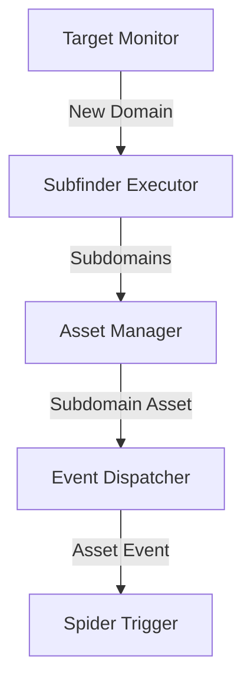

# Subdomain Enumeration System Design

## Overview
This system automates subdomain enumeration for new target domains, integrates with existing asset management, and triggers spider tasks for discovered subdomains. It leverages `subfinder` for discovery and existing event-driven patterns for seamless integration.

---

## System Architecture

### Components
1. **Target Monitor**: Watches for new target domains added to the system.
2. **Subfinder Executor**: Runs `subfinder` on new domains and parses output.
3. **Asset Manager**: Creates and manages subdomain assets.
4. **Event Dispatcher**: Emits events for subdomain asset creation.
5. **Spider Trigger**: Listens for subdomain asset events and initiates spider tasks.



---

## Data Flow & Event Triggers

### 1. Target Monitoring
- **Input**: New target domains added to the system (e.g., via API, database, or file watcher).
- **Trigger**: `TargetAdded` event.
- **Action**: Invoke `Subfinder Executor`.

### 2. Subfinder Execution
- **Command**: `
subfinder -d {{target_domain}} -o {{output_file}} -silent
`
- **Output Parsing**: Extract subdomains from `output_file` (one per line).
- **Error Handling**: Retry failed executions (max 3 attempts).

### 3. Asset Creation
- **Action**: For each discovered subdomain:
  - Create a subdomain asset in the existing asset store.
  - Store metadata (e.g., `discovery_method: "subfinder"`, `parent_domain: {{target_domain}}`).
- **Trigger**: `SubdomainAssetCreated` event for each subdomain.

### 4. Spider Triggering
- **Listener**: Subscribes to `SubdomainAssetCreated` events.
- **Action**: Initiate spider tasks for the subdomain folder.

---

## Error Handling & Retries

### Subfinder Execution
- **Retries**: Exponential backoff (3 attempts).
- **Failures**: Log errors and emit `SubfinderExecutionFailed` event.

### Asset Creation
- **Validation**: Skip invalid subdomains (e.g., duplicates, malformed).
- **Retries**: Retry transient failures (e.g., database errors).

### Event Dispatching
- **Guaranteed Delivery**: Persist events until acknowledged by listeners.

---

## Logging & Observability

### Logs
- **Target Monitoring**: `INFO: Monitoring new target {{domain}}`.
- **Subfinder Execution**: `DEBUG: Subfinder output for {{domain}}: {{subdomains}}`.
- **Asset Creation**: `INFO: Created subdomain asset {{subdomain}}`.
- **Errors**: `ERROR: Failed to execute subfinder for {{domain}}: {{error}}`.

### Metrics
- `subfinder_executions_total` (counter)
- `subdomain_assets_created_total` (counter)
- `subfinder_execution_time_seconds` (histogram)

---

## Subdomain Asset Management

### Storage
- **Structure**: Stored in existing asset store with attributes:
  ```json
  {
    "id": "{{uuid}}",
    "type": "subdomain",
    "value": "{{subdomain}}",
    "parent_domain": "{{target_domain}}",
    "discovery_method": "subfinder",
    "created_at": "{{timestamp}}"
  }
  ```

### Folder Hierarchy
- **Path**: `/assets/subdomains/{{parent_domain}}/{{subdomain}}/`

---

## Spider Integration

### Triggering Spiders
- **Event Listener**: Subscribes to `SubdomainAssetCreated`.
- **Action**: Execute spider task for the subdomain folder:
  ```python
  def handle_subdomain_asset_event(event):
      spider_task = SpiderTask(
          target=event.subdomain,
          folder_path=event.folder_path,
          priority="high"
      )
      spider_task.execute()
  ```

### Spider Monitoring
- **Status**: Track spider task status via existing monitoring system.
- **Output**: Store results in subdomain folder.

---

## Compatibility

### Existing Systems
- **Asset System**: Reuse existing asset creation and storage logic.
- **Event System**: Emit/consume events via existing event bus.
- **Task System**: Integrate with existing task execution framework.

### Dependencies
- `subfinder` (v2.6.6 or later)
- Existing asset, event, and task management libraries.

---

## Example Code

### Subfinder Executor
```python
import subprocess
from pathlib import Path

class SubfinderExecutor:
    def __init__(self, domain: str):
        self.domain = domain
        self.output_file = f"/tmp/subfinder_{domain}.txt"

    def execute(self) -> list[str]:
        try:
            subprocess.run(
                ["subfinder", "-d", self.domain, "-o", self.output_file, "-silent"],
                check=True,
            )
            return Path(self.output_file).read_text().splitlines()
        except subprocess.CalledProcessError as e:
            raise SubfinderExecutionError(f"Failed to run subfinder: {e}")
```

### Event Handler
```python
class SubdomainEventHandler:
    def __init__(self, event_bus):
        self.event_bus = event_bus
        self.event_bus.subscribe("TargetAdded", self.handle_target_added)

    def handle_target_added(self, event):
        executor = SubfinderExecutor(event.domain)
        subdomains = executor.execute()
        for subdomain in subdomains:
            self.event_bus.emit("SubdomainAssetCreated", {
                "subdomain": subdomain,
                "parent_domain": event.domain,
            })
```

---

## Assumptions
1. `subfinder` is installed and available in `PATH`.
2. Existing asset/event/task systems are extensible for subdomains.
3. Spider tasks can be dynamically triggered for new folders.